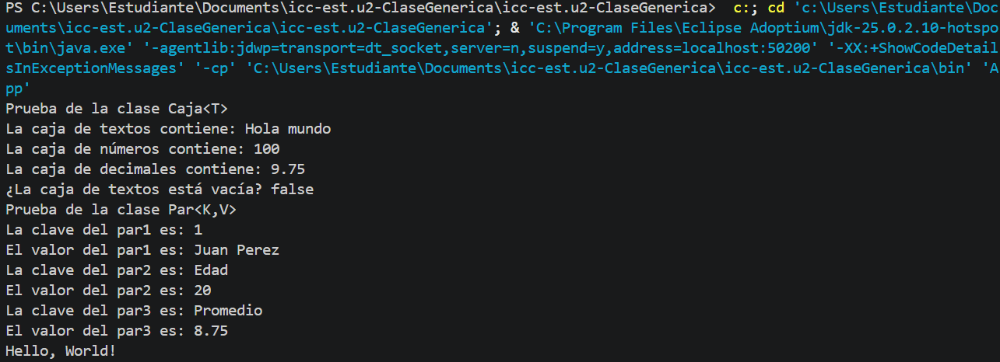
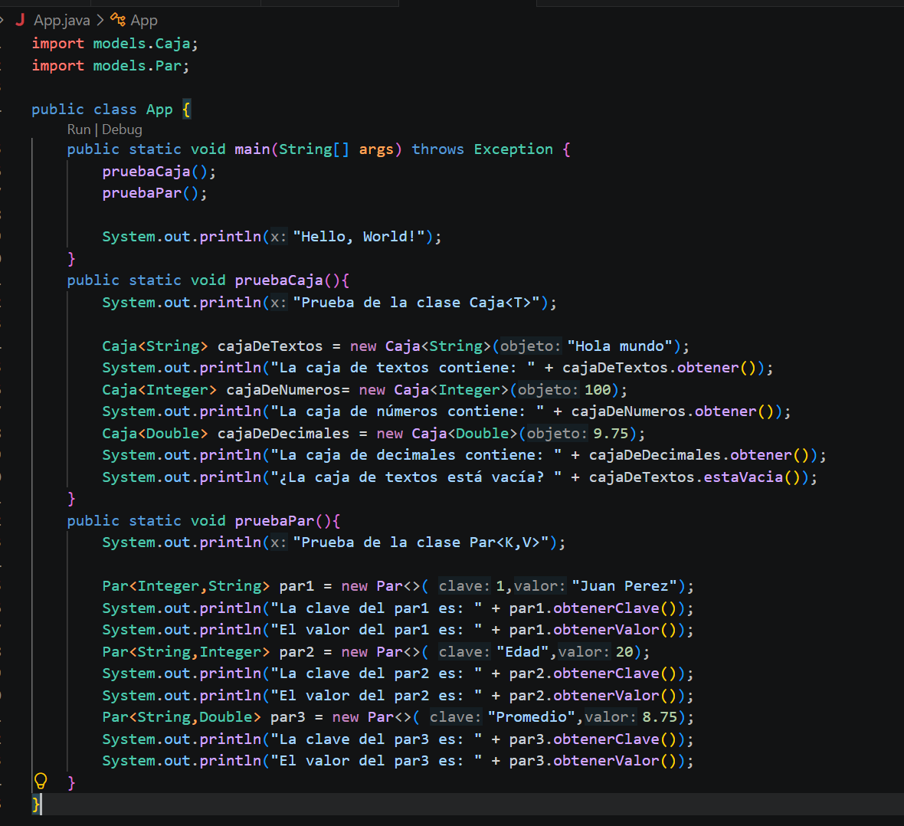

# Práctica: Clases Genéricas en Java

## Datos del Estudiante
- **Nombre:** Nicole Estefania Dominguez Muñoz
- **Curso:**  Grupo 3 - Computacion
- **Fecha:** 2 de Junio del 2026
---

## 1. Implementación de Caja<T> y Par<K, V>

**Fecha:** 2 de Junio del 2026

**Descripción:** En esta práctica se implementaron las clases genéricas Caja<T> y Par<K, V> dentro del paquete models. La clase Caja<T> permite almacenar y obtener un dato de cualquier tipo, mientras que la clase Par<K, V> permite representar una relación entre una clave y un valor. En la captura se muestra la ejecución del programa en consola con diferentes tipos de datos.

---
